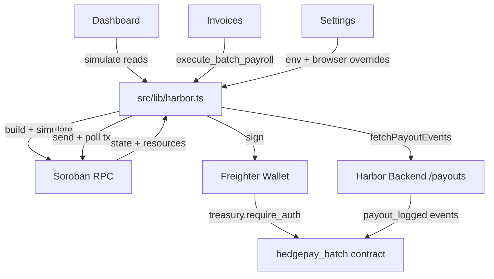

# Harbor Frontend

Web frontend for the Harbor batch-payroll protocol — an on-chain payroll dashboard for the `hedegpay_batch` Soroban contract: live contract state, batch invoice settlement, payout ledger, and runtime network config.

## CI Coverage

Local gates enforced before every push: `npm run lint`, `npm run build` (Next.js type-checks on build).

## Tech stack

- Next.js 14 (App Router), React 18
- TypeScript, Tailwind CSS
- Freighter wallet + `@stellar/freighter-api` 2
- `@stellar/stellar-sdk` 12
- All network access lives in `src/lib/harbor.ts`

## Quickstart

```bash
npm install
npm run dev
```

Open [http://localhost:3000](http://localhost:3000) and install the [Freighter](https://freighter.app) browser extension to connect a wallet.

### Configuration

The app defaults to the public Soroban testnet with a mock contract id so it boots without setup. To talk to a real deployment:

1. Deploy `hedgepay_batch` (see `contracts/hedgepay_batch` in the upstream [Harbor-hq/harbor](https://github.com/Harbor-hq/harbor) repo).
2. `cp .env.local.example .env.local` and fill in `NEXT_PUBLIC_HARBOR_CONTRACT_ID`, `NEXT_PUBLIC_HARBOR_RPC_URL`, and `NEXT_PUBLIC_HARBOR_NETWORK_PASSPHRASE`.
3. Restart `npm run dev`.

Everything can also be overridden at runtime from **Settings** (stored in your browser), which is handy for swapping networks without a rebuild.

| Variable                          | Default                          | Purpose                             |
| --------------------------------- | -------------------------------- | ----------------------------------- |
| `NEXT_PUBLIC_HARBOR_CONTRACT_ID`  | mock placeholder                 | `hedegpay_batch` contract address   |
| `NEXT_PUBLIC_HARBOR_RPC_URL`      | soroban-testnet                  | Soroban RPC endpoint                |
| `NEXT_PUBLIC_HARBOR_NETWORK_PASSPHRASE` | Test SDF Network ; September 2015 | Stellar network passphrase    |
| `NEXT_PUBLIC_HARBOR_TOKEN_DECIMALS` | `6`                            | Decimal places used to format amounts |
| `NEXT_PUBLIC_HARBOR_EVENTS_URL`   | —                                | Payout events API (backend)         |

## What's included

- **Dashboard** — live contract state (admin, treasury, token, max batch size, batch counter, DEX router) via simulate-only reads, with a `NotInitialized` banner until the contract is initialized.
- **Invoices** — compose a payout batch (`BatchRequest` with payees, amounts, departments, optional `target_token`) and submit it via `execute_batch_payroll` through the connected treasury wallet.
- **Ledger** — history of `payout_logged` events fetched from the off-chain events API (`fetchPayoutEvents`).
- **Settings** — point the app at your deployed contract / RPC / network; overrides persist in the browser (`harbor.config.overrides`).

The contract integration layer `src/lib/harbor.ts` is the single source of truth:

- **Read calls** (`admin`, `treasury`, `token`, `max_batch_size`, `batch_counter`, `dex_router`) are simulate-only — no wallet needed.
- **Write calls** (`execute_batch_payroll`) follow a `build -> simulate -> sign (Freighter) -> send -> poll` pipeline. The connected wallet must be the contract **treasury**, since the contract enforces `treasury.require_auth()`.
- **Amount helpers** (`toBaseUnits` / `fromBaseUnits`) convert between human decimal strings and the i128 base units the contract stores.

UI components never import the Stellar SDK directly.

## Architecture & Flow

The following diagram illustrates how the frontend talks to the Soroban contract, the Freighter wallet, and the off-chain payout events API.



```text
                 +-----------------------------+      simulate reads / write pipeline
  +----------+   |       src/lib/harbor.ts     |<--------------------------------------+
  | Dashboard|-->|  - getContractStatus (reads)|                                      |
  +----------+   |  - executeBatchPayroll      |                                      |
                 |  - toBaseUnits/fromBaseUnits|                                      |
  +----------+   +-------------+---------------+
  | Invoices |-->                |
  +----------+                   |  build -> simulate
                                 v
                     +---------------------------+
                     |      Soroban RPC          |----+  getEvents / getLedger
                     +---------------------------+    |
                                 |                     |
                                 | sign (Freighter)    v
                                 v              +-----------------------+
                     +---------------------------+   hedgepay_batch      |
                     |  send + poll transaction  |   (Soroban contract)  |
                     +---------------------------+   require_auth        |
                                 |                     +-----------------+
                                 v                              |
                     +---------------------------+              | payout_logged events
                     |   Harbor Backend (REST)   |<-------------+
                     |   /payouts (SQLite index) |
                     +---------------------------+
```

## Local setup

Prerequisites: Node.js v18+.

```bash
npm install
npm run dev
```

Build and verify:

```bash
npm run lint
npm run build
```

## Development

Use one branch per issue or feature. Follow these conventions:

- Keep all network/contract access inside `src/lib/harbor.ts`; UI components must not import `@stellar/stellar-sdk` directly.
- Use the `build -> simulate -> sign (Freighter) -> send -> poll` pattern from `executeBatchPayroll` for every write path.
- Server components for static shells; `"use client"` only where wallet/async state is needed.
- Verify with `npm run build` (Next.js type-checks on build) and `npm run lint`.

See [docs/ROADMAP.md](docs/ROADMAP.md) for the next contribution opportunities and [CONTRIBUTING.md](CONTRIBUTING.md) for how to land changes.

## Project layout

```
harbor-frontend/
├── .env.local.example             # Env template (mock contract on testnet)
├── .eslintrc.json                 # ESLint config
├── next.config.mjs                # Next.js config
├── tailwind.config.ts             # Tailwind config
├── postcss.config.mjs             # PostCSS config
├── src/
│   ├── app/
│   │   ├── layout.tsx             # Root layout + fonts
│   │   ├── page.tsx               # Landing page
│   │   ├── globals.css            # Global styles
│   │   ├── dashboard/             # Live contract state
│   │   ├── invoices/              # Batch payout form
│   │   ├── ledger/                # Payout event history
│   │   └── settings/              # Runtime network config
│   ├── components/
│   │   ├── BatchPayoutForm.tsx    # Compose + submit a batch
│   │   ├── ContractConfig.tsx     # Contract address / init
│   │   ├── ContractStatus.tsx     # Live contract state
│   │   ├── Nav.tsx                # App navigation
│   │   ├── PayoutEvents.tsx       # Ledger events list
│   │   └── WalletButton.tsx       # Freighter connect
│   └── lib/
│       ├── harbor.ts              # Single contract-integration layer
│       └── useWallet.ts           # Wallet state hook
├── docs/
│   └── ROADMAP.md                 # Contribution opportunities
└── CONTRIBUTING.md                # Developer setup + PR workflow
```

## Operator Guide

Frontend operators wiring the app to a production deployment:

1. Deploy `hedgepay_batch` (see upstream [Harbor-hq/harbor](https://github.com/Harbor-hq/harbor)).
2. Initialize the contract with `initialize(admin, treasury, token)`.
3. Set `NEXT_PUBLIC_HARBOR_CONTRACT_ID`, `NEXT_PUBLIC_HARBOR_RPC_URL`, and `NEXT_PUBLIC_HARBOR_NETWORK_PASSPHRASE` in the deployment env.
4. Deploy the Harbor backend and point `NEXT_PUBLIC_HARBOR_EVENTS_URL` at its `/payouts` endpoint so the Ledger shows real events.
5. The connected Freighter wallet must be the contract **treasury** to submit batches.

## Security Notes

- **Treasury-only writes:** `execute_batch_payroll` can only be run by the contract treasury; the app surfaces clean Unauthorized errors otherwise.
- **Amount handling:** all amounts are converted with `toBaseUnits` / `fromBaseUnits` — never raw math.
- **Network mismatch guard:** the app verifies the wallet's network passphrase matches the configured network before signing.
- **Config isolation:** all contract/RPC access stays in `src/lib/harbor.ts`; UI components never import the Stellar SDK.
- **No secrets in the client:** only public `NEXT_PUBLIC_*` config is shipped to the browser.

## Part of Harbor

Contracts: [Harbor-hq/harbor](https://github.com/Harbor-hq/harbor) · Backend: [Harbor-hq/harbor-backend](https://github.com/Harbor-hq/harbor-backend)
