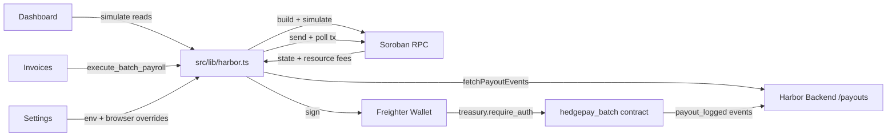

# Harbor Frontend

Web frontend for the **Harbor batch-payroll protocol** — an on-chain payroll dashboard for the `hedegpay_batch` Soroban contract. It provides live contract state, batch invoice settlement, a payout ledger, and runtime network configuration.

Built with Next.js 14 (App Router), TypeScript, Tailwind, Freighter wallet, and `@stellar/stellar-sdk` 12. All network access lives in `src/lib/harbor.ts`.

## Table of Contents

- [Tech stack](#tech-stack)
- [Quickstart](#quickstart)
- [Configuration](#configuration)
- [What's included](#whats-included)
- [Architecture & Flow](#architecture--flow)
- [Local setup](#local-setup)
- [Development](#development)
- [Project layout](#project-layout)
- [Operator Guide](#operator-guide)
- [Security Notes](#security-notes)
- [Part of Harbor](#part-of-harbor)

## Tech stack

- **Framework:** Next.js 14 (App Router) + React 18
- **Language:** TypeScript
- **Styling:** Tailwind CSS
- **Wallet:** Freighter (`@stellar/freighter-api` 2)
- **Stellar SDK:** `@stellar/stellar-sdk` 12
- **Integration layer:** all contract/RPC access in `src/lib/harbor.ts`

## Quickstart

```bash
npm install
npm run dev
```

Open [http://localhost:3000](http://localhost:3000) and install the [Freighter](https://freighter.app) browser extension to connect a wallet.

The app defaults to the public Soroban testnet with a **mock** contract id so it boots without setup — no env vars required to try it.

## Configuration

To talk to a real deployment:

1. Deploy `hedgepay_batch` (see `contracts/hedgepay_batch` in the upstream [Harbor-hq/harbor](https://github.com/Harbor-hq/harbor) repo).
2. `cp .env.local.example .env.local` and fill in the values below.
3. Restart `npm run dev`.

Everything can also be overridden at runtime from **Settings** (stored in the browser under `harbor.config.overrides`), which is handy for swapping networks without a rebuild.

| Variable | Default | Purpose |
| --- | --- | --- |
| `NEXT_PUBLIC_HARBOR_CONTRACT_ID` | mock placeholder | `hedegpay_batch` contract address |
| `NEXT_PUBLIC_HARBOR_RPC_URL` | soroban-testnet | Soroban RPC endpoint |
| `NEXT_PUBLIC_HARBOR_NETWORK_PASSPHRASE` | Test SDF Network ; September 2015 | Stellar network passphrase |
| `NEXT_PUBLIC_HARBOR_TOKEN_DECIMALS` | `6` | Decimal places used to format amounts |
| `NEXT_PUBLIC_HARBOR_EVENTS_URL` | — | Payout events API (Harbor backend `/payouts`) |

Config precedence: **runtime overrides (Settings) -> env vars -> testnet defaults**.

## What's included

### Dashboard (`src/app/dashboard/`)

- Live contract state (admin, treasury, token, max batch size, batch counter, DEX router) via simulate-only reads.
- `NotInitialized` banner until the contract is initialized.
- Powered by `getContractStatus` in `src/lib/harbor.ts`.

### Invoices (`src/app/invoices/`)

- Compose a payout batch: payees, amounts, departments, and optional `target_token` per item.
- Submit via `execute_batch_payroll` using the `build -> simulate -> sign (Freighter) -> send -> poll` pipeline.
- The connected wallet must be the contract **treasury**, since the contract enforces `treasury.require_auth()`.

### Ledger (`src/app/ledger/`)

- History of `payout_logged` events fetched from the off-chain events API (`fetchPayoutEvents`).
- When `NEXT_PUBLIC_HARBOR_EVENTS_URL` is unset, returns an empty list so the UI contracts are stable.

### Settings (`src/app/settings/`)

- Point the app at your deployed contract / RPC / network.
- Overrides persist in the browser; `clearOverrides()` resets to env/defaults.

### Contract integration layer (`src/lib/harbor.ts`)

The single source of truth for talking to the contract and the Stellar network:

- **Read calls** (`admin`, `treasury`, `token`, `max_batch_size`, `batch_counter`, `dex_router`) are simulate-only — no wallet needed.
- **Write calls** (`execute_batch_payroll`) follow the `build -> simulate -> sign (Freighter) -> send -> poll` pipeline, including resource-fee estimation from the simulation and a 30 s poll for the final transaction status.
- **Amount helpers** (`toBaseUnits` / `fromBaseUnits`) convert between human decimal strings and the i128 base units the contract stores.
- **BatchRequest builder** mirrors the contract struct: `BatchRequest { items: Vec<PayoutItem>, declared_total: i128, batch_id: u64 }`.
- **Network-mismatch guard** verifies the wallet passphrase matches the configured network before signing.

UI components never import the Stellar SDK directly.

## Architecture & Flow

The following **Mermaid** diagram renders natively on GitHub:



And the equivalent ASCII flow:

```
 +------------+   simulate reads    +------------------------------+
 | Dashboard  |-------------------->|                              |
 +------------+                     |        src/lib/harbor.ts     |
 +------------+   execute_batch     |  - getContractStatus (reads) |
 |  Invoices  |-------------------->|  - executeBatchPayroll       |
 +------------+                     |  - toBaseUnits/fromBaseUnits |
 +------------+   overrides         |                              |
 |  Settings  |-------------------->|                              |
 +------------+                     +------------+-----------------+
                                                 |  build + simulate
                                                 v
                                     +------------------------------+
                                     |        Soroban RPC           |
                                     +-------------+----------------+
                                                   |
                                                   |  sign (Freighter wallet)
                                                   v
                                     +------------------------------+
                                     |   hedgepay_batch contract    |
                                     |   treasury.require_auth()    |
                                     +-------------+----------------+
                                                   |
                                                   |  payout_logged events
                                                   v
                                     +------------------------------+
                                     |  Harbor Backend (REST)       |
                                     |  /payouts (SQLite index)     |
                                     +------------------------------+
```

## Local setup

Prerequisites: Node.js v18+.

```bash
npm install
npm run dev
```

Build and verify:

```bash
npm run lint
npm run build   # Next.js type-checks during build
```

## Development

Use one branch per issue or feature. Follow these conventions:

- Keep all network/contract access inside `src/lib/harbor.ts`; UI components must not import `@stellar/stellar-sdk` directly.
- Use the `build -> simulate -> sign (Freighter) -> send -> poll` pattern from `executeBatchPayroll` for every write path.
- Server components for static shells; `"use client"` only where wallet/async state is needed.
- Verify with `npm run build` (Next.js type-checks on build) and `npm run lint`.

See [docs/ROADMAP.md](docs/ROADMAP.md) for the next contribution opportunities and [CONTRIBUTING.md](CONTRIBUTING.md) for how to land changes.

## Project layout

```
harbor-frontend/
├── .env.local.example          # Env template (mock contract on testnet)
├── .eslintrc.json              # ESLint config
├── next.config.mjs             # Next.js config
├── tailwind.config.ts          # Tailwind config
├── postcss.config.mjs          # PostCSS config
├── src/
│   ├── app/
│   │   ├── layout.tsx          # Root layout + fonts
│   │   ├── page.tsx            # Landing page
│   │   ├── globals.css         # Global styles
│   │   ├── dashboard/          # Live contract state
│   │   ├── invoices/           # Batch payout form
│   │   ├── ledger/             # Payout event history
│   │   └── settings/           # Runtime network config
│   ├── components/
│   │   ├── BatchPayoutForm.tsx # Compose + submit a batch
│   │   ├── ContractConfig.tsx  # Contract address / init
│   │   ├── ContractStatus.tsx  # Live contract state
│   │   ├── Nav.tsx             # App navigation
│   │   ├── PayoutEvents.tsx    # Ledger events list
│   │   └── WalletButton.tsx    # Freighter connect
│   └── lib/
│       ├── harbor.ts           # Single contract-integration layer
│       └── useWallet.ts        # Wallet state hook
├── docs/
│   └── ROADMAP.md              # Contribution opportunities
└── CONTRIBUTING.md             # Developer setup + PR workflow
```

## Operator Guide

Wire the app to a production deployment:

1. **Deploy + initialize.** Deploy `hedgepay_batch` (see [Harbor-hq/harbor](https://github.com/Harbor-hq/harbor)) and run `initialize(admin, treasury, token)`.
2. **Configure the frontend.** Set `NEXT_PUBLIC_HARBOR_CONTRACT_ID`, `NEXT_PUBLIC_HARBOR_RPC_URL`, and `NEXT_PUBLIC_HARBOR_NETWORK_PASSPHRASE` in the deployment env.
3. **Connect the backend.** Deploy the Harbor backend and point `NEXT_PUBLIC_HARBOR_EVENTS_URL` at its `/payouts` endpoint so the Ledger shows real events.
4. **Connect a treasury wallet.** The Freighter wallet used to submit batches must be the contract **treasury**.

## Security Notes

- **Treasury-only writes:** `execute_batch_payroll` can only be run by the contract treasury; the app surfaces clean Unauthorized errors otherwise.
- **Amount handling:** all amounts are converted with `toBaseUnits` / `fromBaseUnits` — never raw math.
- **Network mismatch guard:** the app verifies the wallet's network passphrase matches the configured network before signing.
- **Config isolation:** all contract/RPC access stays in `src/lib/harbor.ts`; UI components never import the Stellar SDK.
- **No secrets in the client:** only public `NEXT_PUBLIC_*` config is shipped to the browser.

## Part of Harbor

---

Contracts: [Harbor-hq/harbor](https://github.com/Harbor-hq/harbor) · Backend: [Harbor-hq/harbor-backend](https://github.com/Harbor-hq/harbor-backend)
