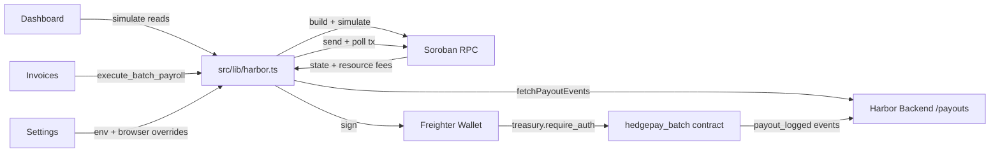

<div align="center">

<h1>Harbor Frontend</h1>

<p><strong>Web dashboard for the Harbor batch-payroll protocol.</strong></p>

<p>
  Live contract state, batch invoice settlement, a payout ledger, and runtime network configuration —<br/>
  powered by <code>hedegpay_batch</code> on Soroban and the Freighter wallet.
</p>

<p>
  
  
  
  
  
</p>

<p>Part of the <a href="https://github.com/Harbor-hq">Harbor</a> ecosystem.</p>

<br/>

</div>

---

## Overview

`harbor-frontend` is the React layer of the Harbor payroll protocol. It provides ready-to-use pages for submitting payroll batches, viewing contract state, and inspecting payout history — without building any of the Stellar wiring yourself.

All contract and network access lives in a single integration layer, `src/lib/harbor.ts`. UI components never import the Stellar SDK directly, so behavior between the SDK and the UI never diverges.

---

## Table of Contents

- [Installation](#installation)
- [Quick Start](#quick-start)
- [Configuration](#configuration)
- [Page Reference](#page-reference)
- [Integration Layer](#integration-layer)
- [Architecture & Flow](#architecture--flow)
- [Design Principles](#design-principles)
- [Contributing](#contributing)
- [License](#license)

---

## Installation

```bash
git clone https://github.com/Harbor-hq/harbor-frontend.git
cd harbor-frontend
npm install
```

Requires Node.js v18+.

---

## Quick Start

```bash
npm run dev
```

Open [http://localhost:3000](http://localhost:3000) and install the [Freighter](https://freighter.app) browser extension to connect a wallet.

The app defaults to the public Soroban testnet with a **mock** contract id so it boots without setup — no env vars required to try it.

---

## Configuration

To talk to a real deployment:

1. Deploy `hedgepay_batch` (see `contracts/hedgepay_batch` in the upstream [Harbor-hq/harbor](https://github.com/Harbor-hq/harbor) repo).
2. `cp .env.local.example .env.local` and fill in the values below.
3. Restart `npm run dev`.

Everything can also be overridden at runtime from **Settings** (stored in the browser under `harbor.config.overrides`), which is handy for swapping networks without a rebuild.

| Variable | Default | Purpose |
| --- | --- | --- |
| `NEXT_PUBLIC_HARBOR_CONTRACT_ID` | mock placeholder | `hedegpay_batch` contract address |
| `NEXT_PUBLIC_HARBOR_RPC_URL` | soroban-testnet | Soroban RPC endpoint |
| `NEXT_PUBLIC_HARBOR_NETWORK_PASSPHRASE` | Test SDF Network ; September 2015 | Stellar network passphrase |
| `NEXT_PUBLIC_HARBOR_TOKEN_DECIMALS` | `6` | Decimal places used to format amounts |
| `NEXT_PUBLIC_HARBOR_EVENTS_URL` | — | Payout events API (Harbor backend `/payouts`) |

**Config precedence:** runtime overrides (Settings) -> env vars -> testnet defaults.

---

## Page Reference

| Page | Purpose |
| --- | --- |
| **Dashboard** | Live contract state (admin, treasury, token, max batch size, counter, DEX router) via simulate-only reads. `NotInitialized` banner until initialized. |
| **Invoices** | Compose a payout batch (payees, amounts, departments, optional `target_token`) and submit via `execute_batch_payroll`. |
| **Ledger** | History of `payout_logged` events fetched from the off-chain events API. |
| **Settings** | Point the app at your deployed contract / RPC / network; overrides persist in the browser. |

---

## Integration Layer

`src/lib/harbor.ts` is the single source of truth for talking to the contract and the Stellar network:

- **Read calls** (`admin`, `treasury`, `token`, `max_batch_size`, `batch_counter`, `dex_router`) are simulate-only — no wallet needed.
- **Write calls** (`execute_batch_payroll`) follow a `build -> simulate -> sign (Freighter) -> send -> poll` pipeline, including resource-fee estimation from the simulation and a 30 s poll for the final transaction status.
- **Amount helpers** (`toBaseUnits` / `fromBaseUnits`) convert between human decimal strings and the i128 base units the contract stores.
- **BatchRequest builder** mirrors the contract struct: `BatchRequest { items, declared_total, batch_id }`.
- **Network-mismatch guard** verifies the wallet passphrase matches the configured network before signing.

The connected wallet must be the contract **treasury**, since the contract enforces `treasury.require_auth()`.

```tsx
// Connect + read contract state
const { publicKey } = await getWalletState();
const status = await getContractStatus(publicKey ?? undefined);

// Submit a batch (connected wallet must be the contract treasury)
await executeBatchPayroll(request, publicKey);
```

---

## Architecture & Flow

The following **Mermaid** diagram renders natively on GitHub:



And the equivalent ASCII flow:

```
 +------------+   simulate reads    +------------------------------+
 | Dashboard  |-------------------->|                              |
 +------------+                     |        src/lib/harbor.ts     |
 +------------+   execute_batch     |  - getContractStatus (reads) |
 |  Invoices  |-------------------->|  - executeBatchPayroll       |
 +------------+                     |  - toBaseUnits/fromBaseUnits |
 +------------+   overrides         |                              |
 |  Settings  |-------------------->|                              |
 +------------+                     +------------+-----------------+
                                                 |  build + simulate
                                                 v
                                     +------------------------------+
                                     |        Soroban RPC           |
                                     +-------------+----------------+
                                                   |
                                                   |  sign (Freighter wallet)
                                                   v
                                     +------------------------------+
                                     |   hedgepay_batch contract    |
                                     |   treasury.require_auth()    |
                                     +-------------+----------------+
                                                   |
                                                   |  payout_logged events
                                                   v
                                     +------------------------------+
                                     |  Harbor Backend (REST)       |
                                     |  /payouts (SQLite index)     |
                                     +------------------------------+
```

### Component map

| Component | Purpose |
| --- | --- |
| `BatchPayoutForm.tsx` | Compose + submit a batch. |
| `ContractConfig.tsx` | Contract address / initialization. |
| `ContractStatus.tsx` | Live contract state display. |
| `Nav.tsx` | App navigation. |
| `PayoutEvents.tsx` | Ledger events list. |
| `WalletButton.tsx` | Freighter connect. |
| `useWallet.ts` (`src/lib`) | Wallet state hook. |

---

## Design Principles

**Single integration point** — all Stellar access lives in `src/lib/harbor.ts`; UI components never import the Stellar SDK directly.

**Treasury-only writes** — `execute_batch_payroll` can only be run by the contract treasury; the app surfaces clean Unauthorized errors otherwise.

**Build -> simulate -> sign -> send -> poll** — every write path shares the same pipeline, including resource-fee estimation and transaction polling.

**BigInt-safe amounts** — all amounts are converted with `toBaseUnits` / `fromBaseUnits`; never raw math.

**Config over control-flow** — network/contract/RPC are runtime-overridable from Settings, layered over env vars and testnet defaults.

**No secrets in the client** — only public `NEXT_PUBLIC_*` config is shipped to the browser.

---

## Contributing

Pull requests are welcome. For significant changes, please open an issue first to discuss what you'd like to change.

See [CONTRIBUTING.md](CONTRIBUTING.md) for development guidelines, code style, and the PR process.

Verify before pushing:

```bash
npm run build   # Next.js type-checks during build
npm run lint
```

See [docs/ROADMAP.md](docs/ROADMAP.md) for the next contribution opportunities (contract init UI, admin functions, payout events API + ledger, client-side batch validation, CSV import, multi-sig treasury).

---

## License

[MIT](LICENSE)
